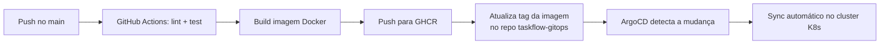

# TaskFlow API

Pequena API REST (FastAPI) usada como aplicação de exemplo para demonstrar um
fluxo completo de **CI/CD + GitOps**: build/test/push da imagem em um repositório
de aplicação, e deploy declarativo via **ArgoCD** a partir de um repositório
GitOps separado ([`taskflow-gitops`](https://github.com/FelipeFranca07/taskflow-gitops)).

## Arquitetura do fluxo



1. Push/PR no `main` dispara o pipeline de CI (lint com `ruff`, testes com `pytest`).
2. Em push no `main`, a imagem é construída e publicada no **GHCR**
   (`ghcr.io/felipefranca07/taskflow-api`), tagueada com o SHA do commit.
3. O pipeline então atualiza automaticamente a tag da imagem no overlay `dev`
   do repositório [`taskflow-gitops`](https://github.com/FelipeFranca07/taskflow-gitops)
   (via `kustomize edit set image`) e faz commit/push dessa mudança.
4. O **ArgoCD**, que monitora o repositório GitOps, detecta a mudança e
   sincroniza automaticamente o cluster — sem nenhum `kubectl apply` manual.

Esse é o padrão real usado em produção: o repositório de aplicação nunca
aplica manifests diretamente no cluster; ele só gera artefatos e atualiza
declarações de estado desejado. Quem realiza o deploy é sempre o ArgoCD.

## Pipelines de referência

O CI que efetivamente roda neste repositório é o **GitHub Actions**
(`.github/workflows/ci-cd.yml`). Também incluí, como referência, o mesmo
fluxo implementado em:

- `azure-pipelines.yml` — equivalente em Azure DevOps (usado no meu dia a dia)
- `.gitlab-ci.yml` — equivalente em GitLab CI

para demonstrar a mesma lógica de pipeline portada entre as três plataformas
mais usadas no mercado hoje.

## Rodando localmente

```bash
pip install -r requirements-dev.txt
uvicorn app.main:app --reload
```

```bash
docker build -t taskflow-api .
docker run -p 8000:8000 taskflow-api
```

Endpoints: `GET /health`, `GET /ready`, `GET /tasks`, `POST /tasks`,
`GET /tasks/{id}`, `DELETE /tasks/{id}`.

## Repositório GitOps

Manifests Kubernetes, overlays por ambiente (dev/staging/prod) e
Applications do ArgoCD (padrão *App of Apps*) ficam em
[`taskflow-gitops`](https://github.com/FelipeFranca07/taskflow-gitops).
